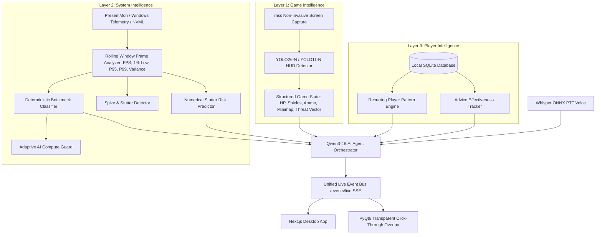

# CogniEdge AI Gaming Companion — Production Architecture

> **Positioning**: A fully local AI gaming co-pilot that understands the game screen, learns how the player behaves across sessions, and understands the PC's real-time gaming performance.

---

## 1. System Intelligence Layers

---

## 2. Core Subsystems

### 2.1 Game Intelligence Layer
- **Safety First**: Zero DLL injection, zero game process hooking, zero memory inspection, zero network modification.
- **Screen Understanding**: Screen capture worker feeds lightweight YOLO quantized model (INT8/W8A16) to extract JSON player vitals and threat vectors.
- **Data Provenance**: Explicit tagging as `MEASURED`, `DEMO`, or `UNAVAILABLE`.

### 2.2 System Intelligence Layer (AI Performance Doctor)
- **Multi-Vendor Hardware Detection**: Probes active CPU, NVIDIA GPU (NVML/SMI), Windows performance counters, and NPU providers (DirectML/QNN).
- **Frame-Time Consistency Engine**: Computes rolling average FPS, 1% Low FPS, 0.1% Low FPS, P50/P95/P99 frame times, and frame-time variance (ms²).
- **Deterministic Bottleneck Classifier**:
  - `GPU_BOUND`: GPU load > 90%
  - `CPU_BOUND`: Single render thread saturated while GPU under-utilized
  - `VRAM_PRESSURE`: VRAM allocation > 92% with elevated frame variance
  - `THERMAL_LIMIT`: GPU temp > 84°C with throttled clocks
  - `BACKGROUND_PROCESS_INTERFERENCE`: Non-game process contending for CPU/disk cycles
  - `FRAME_TIME_INSTABILITY`: Jitter during rapid texture streaming
- **Numerical Stutter Risk Predictor**: Forecasts stutter probability in upcoming 1500ms window without overloading the LLM.
- **Adaptive AI Compute Guard**: Dynamically scales CogniEdge's own workload (e.g. 3.0 FPS → 1.0 FPS screen sampling) during heavy GPU combat spikes.

### 2.3 Player Intelligence Layer
- **Persistent SQLite Database**: Local-only storage for cross-session coaching history.
- **Recurring Patterns**: Identifies habits like sub-30% HP over-engagement or delayed choke rotations.
- **Advice Effectiveness**: Measures whether player survival actually improved after following AI advice.

### 2.4 Reasoning & Orchestration Layer (Qwen3-4B)
- **LocalLLMProvider Abstraction**:
  - Auto-detection: Qualcomm Genie SDK (Hexagon NPU) → Local OpenAI endpoint (Ollama/vLLM/LMStudio) → High-Fidelity Fallback.
  - Controlled Tool Registry: Safe inspection of game state, performance metrics, and player memory.

### 2.5 Presentation Layer
- **Next.js Desktop UI**: Command center, Live in-game monitor, Performance Doctor, Post-game coaching debrief, Player memory profile, A/B benchmark runner, and Settings.
- **Native PyQt6 HUD Overlay**: Click-through, always-on-top, translucent in-game overlay preserving clear center gameplay focus.
